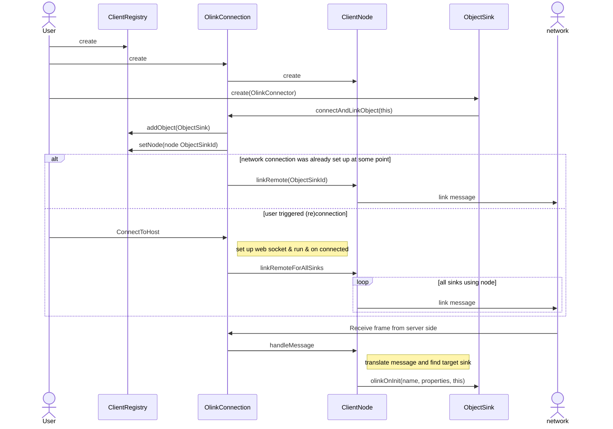
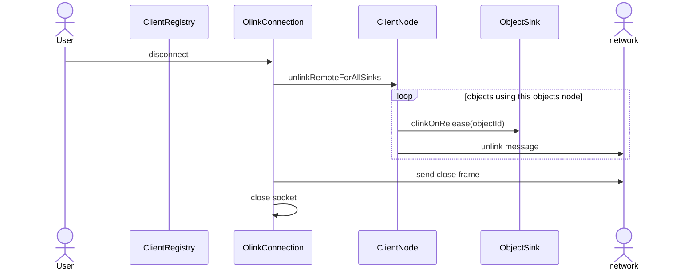
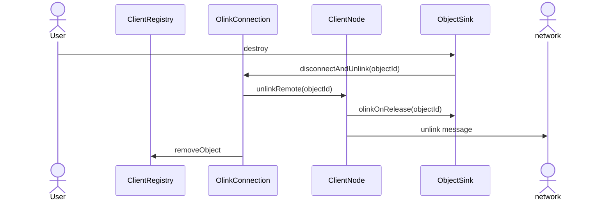
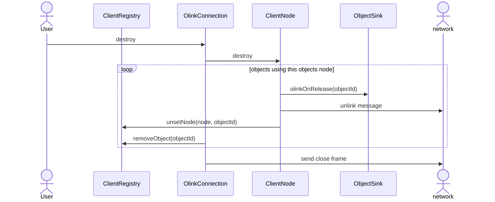
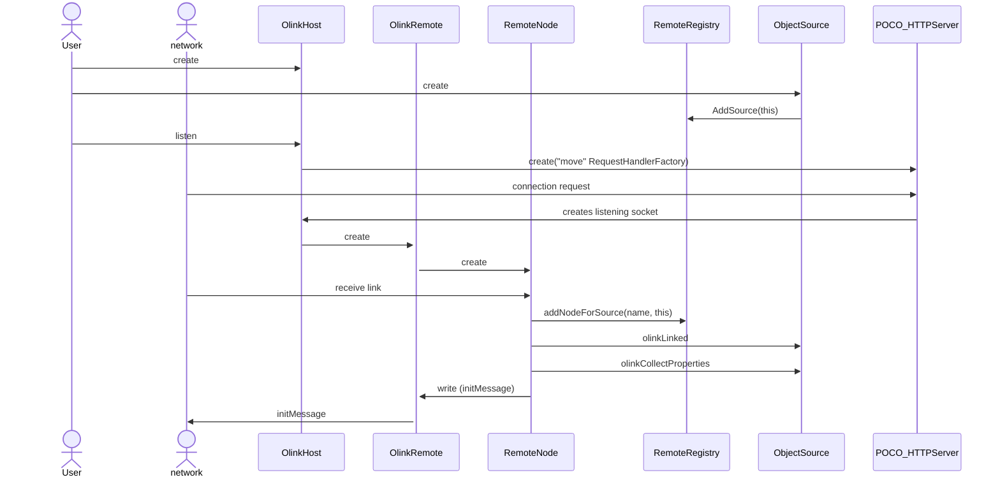
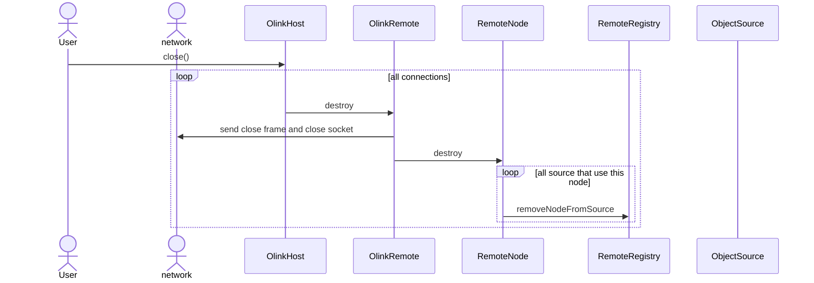
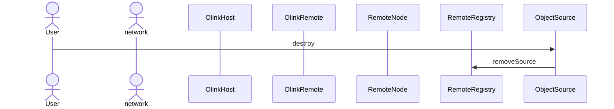
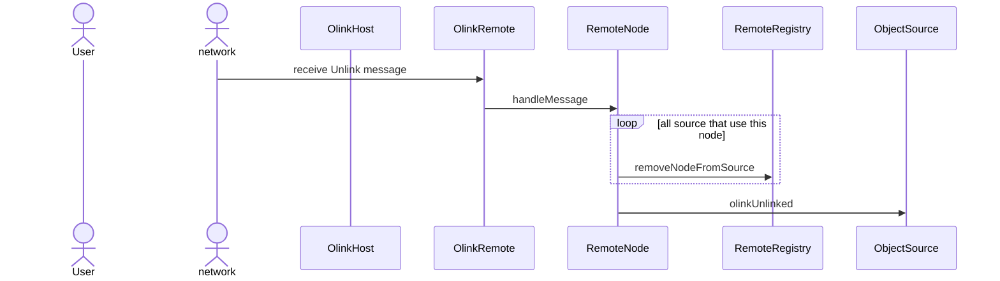
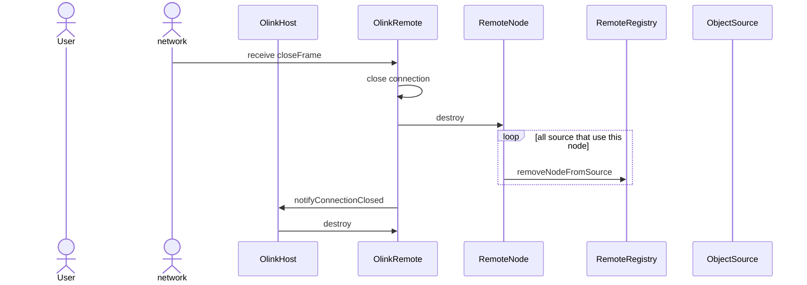

# Lifecycle
ApiGear delivers implementation for Olink protocol and related classes to help you start using your interface over the network with our ready to use classes.
You can find Olink Core library which contains:
 - registry for client (ClientRegistry) and server (RemoteRegistry) that keeps track of currently used endpoint nodes, sinks or sources
 - endpoint nodes (ClientNode and RemoteNode) which are abstraction above the network layer
 These classes are independent from network implementation. They also provide interface for sink and source which are abstraction for your interface network adapters.
 
 generated apigear feature contains Olink Implementation for network service:
 - adapters for network services (using poco implementation) OlinkConnection and OlinkHost:
Classes that take care of setting up connection for client and server. They use Olink core registry and nodes.

generated olink feature contains Interface dependent adapters: 
 - "YourInterface"Client for client side which is a Sink object
 - "YourInterface"Service for server side which is a Source object
 
To have a better overview of classes responsibilities and protocol implementation we provide a sequence diagram for lifecycle messages.

## Client side sequence diagram

### Setup scenario

### Tear down scenario: Disconnect OlinkConnection.
User calls disconnect on OlinkConnection while connection is running and SinkObject (InterfaceClient) is attached.

Note: Node is not removed from the sinks in the registry, it is necessary for reconnect.

### Tear down scenario: The ObjectSink (InterfaceClient) is destroyed.

### Tear down scenario: OlinkConnection object is destroyed without call disconnect.

## Server side sequence diagram

Poco implementation is simplified here to one class POCO_HTTPServer. It processes the request, calls the custom Poco::Net::HTTPRequestHandler, which makes a WebSocket for each connection.
This WebSocket is passed back to a class that manages the connections and used for implementation of sending and receiving messages - here OlinkRemote class.
The POCO_HTTPServer appears only in set up scenario as it is relevant for creating connection and not interesting in later interactions. 

### Set up scenario

The connection cannot exist without a service. So first the Source Object must be created and added to Registry, then it is allowed to create a nodes to serve the connection.
Otherwise the node won't accept the LinkMessage and the client won't be served.

### Tear down scenario: Close OlinkHost.
Close all connections with OlinkHost, while server is running and clients are attached.

### Tear down scenario: Destroy source.

### Tear down scenario: Unlink Source message from client.

Object serving a connection: OlinkRemote and RemoteNode are not destroyed, they may serve other services(sources) for client.

### Tear down scenario: Receive close frame for a connection.

